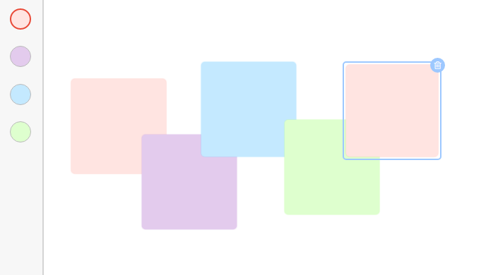
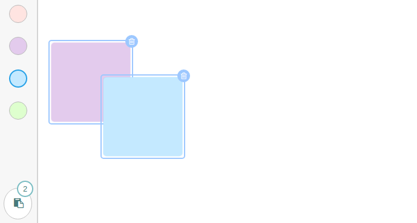

<p align="center">
    
</p>

---

<h4 align="center">A simple mural with Sticky Notes. You can add, edit and delete Sticky Notes</h4>

<p align="center">Made as a coding challenge for an interview.</p>

## Live Example

You can test the application in the following link: <a href="https://react-mini-mural.netlify.com/" target="_blank">React Mini Mural</a>

## How to Use

To clone and run this application, you'll need Git, Node.js and Yarn installed on your computer. From your command line:

```
# Clone this repository
$ git clone https://github.com/amitmerchant1990/electron-markdownify

# Go into the repository
$ cd react-mini-mural

# Install dependencies
$ yarn install

# Run the app
$ yarn start
```

* Add Notes: Double Click
* Select Note: Click
* Multiple Selection: <kbd>Shift</kbd> + Click
* Copy Notes: <kbd>CTRL</kbd>+<kbd>C</kbd>
* Paste Notes: <kbd>CTRL</kbd>+<kbd>V</kbd>

<p align="center">
    
</p>

<p align="center">
    
</p>

## Running the tests

To run the tests of this project. From your command line:

```
$ yarn test
```

## Notes

* Only reducers have tests
* First time dealing with eventlisteners mixed with React and for some reason it's quite tricky.
* Only tested in Chrome

## Things I would have liked to Add

If I had more time I would have like to add more tests and try E2E tests with [puppeteer](https://github.com/GoogleChrome/puppeteer). Also it would be nice to save notes in localstorage.

## License

This project is licensed under the MIT License - see the [LICENSE.md](LICENSE.md) file for details
